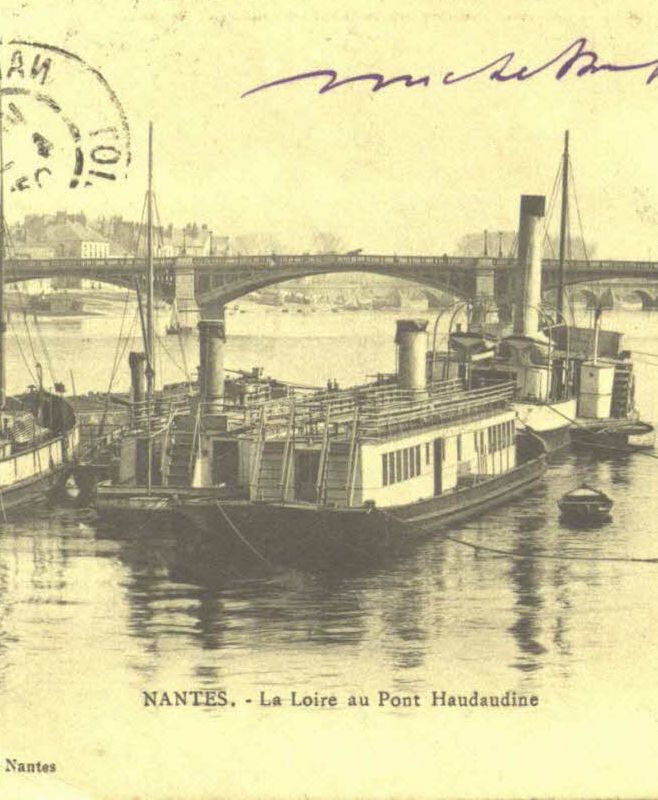

Plan :

1. [Le sujet : les ponts dans la région Pays de la Loire <2>](#t1)
2. [Objectifs <3>](#t2)
3. [Evaluation <4>](#t3)
4. [Rythme et degré de difficulté <5>](#t4)
5. [Accès aux documents <6>](#t5)
6. [Sauvegarder son travail <7>](#t6)

[comment]: <> (FINET)

<a id='t1'/>

# Le sujet : les ponts dans la région Pays de la Loire <2>
[comment1]: <1> (TITRE1)

<!--
	https://www.tablettes-rennaises.fr/app/photopro.sk/rennes/detail?docid=430788
	
	https://www.tablettes-rennaises.fr/app/photopro.sk/rennes/detail?docid=231
-->

<a id='t2'/>

# Objectifs <3>
[comment2]: <1> (TITRE1)

- Récolter des données en ligne sur les sites pertinentes
- Construire une base de données relationnelles dans un tableur
- Produire des statistiques et les visualiser
- Publier la base de données dans un *système de gestion de contenu*[^1] libre : Omeka

[^1]: CMS pour *content management system*.

<a id='t3'/>

# Evaluation <4>
[comment3]: <1> (TITRE1)

- Contrôle continu intégral
- Atteindre les objectifs !
- Remettre des fichiers et des données de qualités
- Au fil des séances, un peu de travail à la maison

<a id='t4'/>

# Rythme et degré de difficulté <5>
[comment4]: <1> (TITRE1)

**Mes objectifs** :

- Que les personnes du groupe les moins à l'aise en informatique puissent avoir 20/20

[comment5]: <1> (Si j'ouvre un tableur, qui se sent déjà un peu mal ?)

- Que vous vous sentiez capables de réutiliser ces apprentissages pour vos propres recherches (SAV)

**Votre implication** :

- Assiduité
- Entraînement

<a id='t5'/>

# Accès aux documents <6>
[comment6]: <1> (TITRE1)

<a id='t6'/>

# Sauvegarder son travail <7>
[comment7]: <1> (TITRE1)

